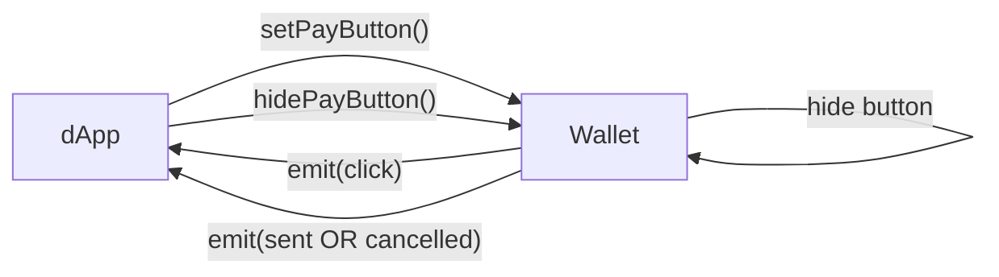

# Tonkeeper InstantPay — Browser Interaction Protocol Specification

**Version:** 1.0 (Draft, July 2025)

---

## 1. Overview

Tonkeeper InstantPay 1.0 defines a minimal browser‑level interface that lets a dApp display a **Pay** button and receive synchronous feedback from the Tonkeeper wallet browser extension. The protocol exposes exactly **three** public entry points:

| API               | Purpose                                                  |
| ----------------- | -------------------------------------------------------- |
| `setPayButton()`  | Render or update the Pay button                          |
| `hidePayButton()` | Remove the button and cancel the active invoice (if any) |
| `events`          | Subject‑style emitter (`click → sent / cancelled`)       |

Everything else—fee calculation, transaction submission, network errors—happens **inside** the wallet; the dApp only learns whether the transaction was broadcast or cancelled.

### 1.1 Flow diagram



*For every `invoiceId` the wallet emits **exactly one** terminal event—either `sent` or `cancelled`—after `click`.*

---

## 2. Wallet Injection

On page load the extension injects a global object:

```typescript
window.tonkeeper.instantPay = {
  config: InstantPayConfig;          // limits, network, label presets
  setPayButton(params): void;        // render / update the button
  hidePayButton(): void;             // remove the button
  events: InstantPayEmitter;         // click / sent / cancelled events
};
```

### 2.1 `InstantPayConfig`

```typescript
interface InstantPayConfig {
  network: 'mainnet' | 'testnet';
  instantPayLimitTon: string;
  jettons: {
    symbol: string;
    address: string;
    decimals: number;
    instantPayLimit: string;
  }[];
  payLabels: ('buy' | 'unlock' | 'use' | 'get' | 'open' | 'start' | 'retry' | 'show' | 'play' | 'try')[];
}
```

### 2.2 `SetPayButtonParams`

```typescript
interface SetPayButtonParams {
  amount: string;              // decimal string, includes network fee
  recipient: string;           // bounceable TON address
  label: InstantPayConfig['payLabels'][number];
  invoiceId: string;           // UUID, unique per transaction
  jetton?: string;             // optional jetton master address
  adnlAddress?: string;        // optional merchant ADNL
}
```

---

## 3. Synchronous API

### 3.1 `setPayButton(params)`

* Validates the input and throws synchronously on error:

  * `InstantPayInvalidParamsError`
  * `InstantPayLimitExceededError`
  * `InstantPayConcurrentOperationError`
* On success the wallet renders or updates the overlay button.

### 3.2 `hidePayButton()`

* Removes the button and clears the active `invoiceId`.
* Idempotent—extra calls are ignored.

### 3.3 Error Classes

```typescript
class InstantPayInvalidParamsError extends Error {}
class InstantPayLimitExceededError extends Error {
  invoiceId: string;
  limit: string;
}
class InstantPayConcurrentOperationError extends Error {
  activeInvoiceId: string;
}
```

---

## 4. Event Emitter

```typescript
interface InstantPayEmitter {
  on<E extends IPEvent['type']>(
    type: E,
    fn: (e: Extract<IPEvent, { type: E }>) => void
  ): () => void;
  off<E extends IPEvent['type']>(
    type: E,
    fn: (e: Extract<IPEvent, { type: E }>) => void
  ): void;
  // `emit` is wallet‑internal only
}

type IPEvent =
  | { type: 'click'; invoiceId: string }
  | { type: 'sent'; invoiceId: string; boc: string }
  | { type: 'cancelled'; invoiceId: string };
```

*Listeners fire synchronously in the same event loop tick as `emit`.*

---

## 5. Usage Examples

### dApp code

```typescript
const ip = window.tonkeeper?.instantPay;
if (!ip) throw new Error('Tonkeeper not installed');

ip.setPayButton({
  amount: '1',
  recipient: 'EQC…',
  label: 'buy',
  invoiceId: crypto.randomUUID()
});

const off = ip.events.on('sent', ({ boc }) => {
  console.log('broadcasted', boc);
  ip.hidePayButton();
  off();
});
```

### Wallet‑side implementation sketch

```typescript
// after the user taps the overlay button
this.events.emit({ type: 'click', invoiceId });

// after signing & broadcasting
this.events.emit({ type: 'sent', invoiceId, boc });
```

---

*End of specification*
