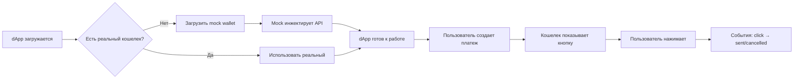

# Tonkeeper InstantPay - Implementation & Testing Environment

Этот проект реализует **Tonkeeper InstantPay Browser Interaction Protocol** согласно спецификации в `SPECIFICATION.md`. Предоставляет как кошелек, так и dApp реализации для тестирования и разработки нового протокола.

## 🚀 Быстрый старт

### Установка зависимостей
```bash
npm install
```

### Запуск в режиме разработки
```bash
# Запустить и mock wallet и dApp одновременно
npm run dev

# Или запускать отдельно:
npm run dev:mock-wallet  # Mock кошелек на http://localhost:3001
npm run dev:dapp         # dApp на http://localhost:3000
```

### Сборка проекта
```bash
npm run build
```

## 📁 Архитектура проекта

```
instant-pay/
├── packages/
│   ├── types/              # Общие TypeScript типы и интерфейсы
│   ├── mock-wallet/        # Mock кошелек-расширение
│   └── dapp/              # Тестовое dApp приложение
├── SPECIFICATION.md        # Спецификация протокола  
└── README.md
```

## 🧩 Компоненты

### 1. Types Package (`packages/types/`)
- Общие TypeScript интерфейсы из спецификации
- Классы ошибок (`InstantPayInvalidParamsError`, `InstantPayLimitExceededError`, `InstantPayConcurrentOperationError`)
- Константы протокола

### 2. Mock Wallet (`packages/mock-wallet/`)
- Инжектирует `window.tonkeeper.instantPay` API
- Реализует все методы протокола
- Отображает кнопку оплаты поверх страницы
- Симулирует обработку транзакций
- Имеет веб-интерфейс для мониторинга и отладки

### 3. dApp (`packages/dapp/`)
- Тестовое приложение для валидации протокола
- **Умный Fallback**: автоматически подключает mock wallet если реального нет
- Множественные сценарии тестирования
- Логирование событий в реальном времени
- Демонстрация обработки ошибок

## 🎯 Как это работает

### Умный Fallback механизм

1. **dApp проверяет наличие реального кошелька** (`window.tonkeeper?.instantPay`)
2. **Если реальный кошелек найден** - использует его
3. **Если реального кошелька нет** - динамически загружает mock wallet
4. **Mock wallet инжектирует API** и показывает уведомление о fallback режиме

### Поток событий



## 🧪 Тестовые сценарии

### Быстрые тесты
- ✅ **Базовый TON платеж** - простая оплата в TON
- ✅ **USDT платеж** - оплата в jetton токене  
- ✅ **Тест лимитов** - превышение лимитов суммы
- ✅ **Тест конкурентности** - параллельные операции

### Тестирование ошибок
- ✅ `InstantPayInvalidParamsError` - некорректные параметры
- ✅ `InstantPayLimitExceededError` - превышение лимитов
- ✅ `InstantPayConcurrentOperationError` - конкурентные операции

### Пользовательские сценарии
- Настраиваемые суммы и токены
- Различные метки платежей (`buy`, `unlock`, `use`, etc.)
- Тестирование с реальными TON адресами

## 🎮 Интерфейс управления

### dApp Dashboard
- Статус кошелька (реальный/mock)
- Текущая сеть и лимиты
- Активный invoice ID
- Конфигурация API
- Логи событий в реальном времени

### Mock Wallet Controls  
- Активация/деактивация кошелька
- Симуляция различных ошибок
- Мониторинг API вызовов
- Экспорт логов

## 📊 API Реализация

### Wallet API (`window.tonkeeper.instantPay`)

```typescript
interface InstantPayAPI {
  config: InstantPayConfig;          // лимиты, сеть, поддерживаемые jettons
  setPayButton(params): void;        // показать/обновить кнопку
  hidePayButton(): void;             // скрыть кнопку
  events: InstantPayEmitter;         // события click/sent/cancelled
}
```

### События
```typescript
type InstantPayEvent =
  | { type: 'click'; invoiceId: string }
  | { type: 'sent'; invoiceId: string; boc: string }
  | { type: 'cancelled'; invoiceId: string };
```

## 🛠️ Разработка

### Команды разработки
```bash
# Сборка всех компонентов
npm run build

# Очистка dist папок
npm run clean

# Сборка конкретного пакета
cd packages/types && npm run build
cd packages/mock-wallet && npm run build  
cd packages/dapp && npm run build
```

### Структура portов
- **Mock Wallet**: http://localhost:3001
- **dApp**: http://localhost:3000
- **Cross-Origin**: Настроен для работы между портами

## 🔧 Настройка

### Mock Wallet конфигурация
```typescript
config: {
  network: 'testnet',
  instantPayLimitTon: '10',
  jettons: [
    { symbol: 'USDT', address: 'EQ...', decimals: 6, instantPayLimit: '1000' },
    { symbol: 'USDC', address: 'EQ...', decimals: 6, instantPayLimit: '1000' }
  ],
  payLabels: ['buy', 'unlock', 'use', 'get', 'open', 'start', 'retry', 'show', 'play', 'try']
}
```

## 🎯 Цели проекта

Этот проект создан для:
- ✅ **Валидации соответствия спецификации** InstantPay
- ✅ **Тестирования крайних случаев** и условий ошибок  
- ✅ **Демонстрации паттернов интеграции** для разработчиков
- ✅ **Оценки производительности и UX** протокола
- ✅ **Обкатки нового протокола** без установки реального расширения

## ⚠️ Важные примечания

- Mock wallet **симулирует** поведение реального расширения, но не выполняет настоящие блокчейн транзакции
- BOC значения генерируются случайно для демонстрации
- Сеть по умолчанию: **testnet**
- Проект предназначен для **разработки и тестирования**, не для продакшена

## 🤝 Использование

1. **Запустите dev серверы**: `npm run dev`
2. **Откройте dApp**: http://localhost:3000  
3. **Увидите уведомление о fallback** на mock wallet
4. **Тестируйте сценарии** через интерфейс dApp
5. **Мониторьте логи** в реальном времени
6. **Открывайте mock wallet панель**: http://localhost:3001 для дополнительных контролов

---

**Построено для тестирования Tonkeeper InstantPay Protocol v1.0**