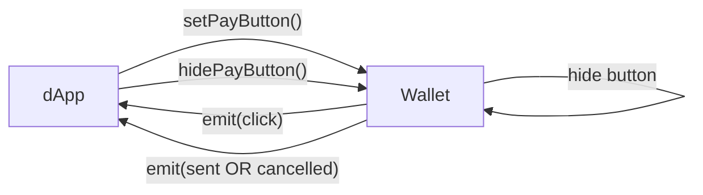

# Tonkeeper InstantPay — Browser Interaction Protocol Specification

**Version:** 1.0 (Draft, July 2025)

---

## 1. Overview

Tonkeeper InstantPay 1.0 определяет минимальный браузерный интерфейс, через который dApp показывает кнопку «Оплатить» и получает синхронную обратную связь от кошелька‑расширения Tonkeeper. Протокол строится на трёх публичных точках:

| API               | Назначение                                  |
| ----------------- | ------------------------------------------- |
| `setPayButton()`  | Показать/обновить платёжную кнопку          |
| `hidePayButton()` | Скрыть кнопку и отменить активный invoice   |
| `events`          | Субъект‑эмиттер (`click → sent/ cancelled`) |

Все остальные детали (учёт комиссий, отправка транзакций, сетевые ошибки) остаются внутри кошелька; dApp узнаёт только факт отправки либо отмены.

### 1.1 Flow диаграмма



*Для каждого `invoiceId` после `click` кошелёк эмитит **ровно одно** событие — либо `sent`, либо `cancelled`.*

---

## 2. Wallet Injection

При загрузке страницы расширение создаёт глобальный объект:

```typescript
window.tonkeeper.instantPay = {
  config: InstantPayConfig;          // лимиты, сеть, подписи
  setPayButton(params): void;        // показать / обновить кнопку
  hidePayButton(): void;             // убрать кнопку
  events: InstantPayEmitter;         // события click / sent / cancelled
};
```

### 2.1 `InstantPayConfig`

```typescript
interface InstantPayConfig {
  network: 'mainnet' | 'testnet';
  instantPayLimitTon: string;
  jettons: {
    symbol: string;
    address: string;
    decimals: number;
    instantPayLimit: string;
  }[];
  payLabels: ('buy' | 'unlock' | 'use' | 'get' | 'open' | 'start' | 'retry' | 'show' | 'play' | 'try')[];
}
```

### 2.2 `SetPayButtonParams`

```typescript
interface SetPayButtonParams {
  amount: string;              // десятичная строка (с учётом fee)
  recipient: string;           // TON‑адрес получателя (bounce‑able)
  label: InstantPayConfig['payLabels'][number];
  invoiceId: string;           // UUID — уникален для транзакции
  jetton?: string;             // опционально: адрес токена
  adnlAddress?: string;        // опционально: ADNL мерчанта
}
```

---

## 3. Synchronous API

### 3.1 `setPayButton(params)`

* Валидирует входные данные; при ошибке бросает одно из исключений:

  * `InstantPayInvalidParamsError`
  * `InstantPayLimitExceededError`
  * `InstantPayConcurrentOperationError`
* При успехе кошелёк отображает (или обновляет) кнопку поверх страницы.

### 3.2 `hidePayButton()`

* Скрывает кнопку и сбрасывает активный `invoiceId`.
* Идempotентен — повторные вызовы игнорируются.

### 3.3 Error Classes

```typescript
class InstantPayInvalidParamsError extends Error {}
class InstantPayLimitExceededError extends Error {
  invoiceId: string;
  limit: string;
}
class InstantPayConcurrentOperationError extends Error {
  activeInvoiceId: string;
}
```

---

## 4. Event Emitter

```typescript
interface InstantPayEmitter {
  on<E extends Event['type']>(type: E, fn: (e: Extract<Event,{type:E}>) => void): () => void;
  off<E extends Event['type']>(type: E, fn: (e: Extract<Event,{type:E}>) => void): void;
  // wallet‑internal emit
}

type Event =
  | { type: 'click'; invoiceId: string }
  | { type: 'sent'; invoiceId: string; boc: string }
  | { type: 'cancelled'; invoiceId: string };
```

*Слушатели вызываются синхронно в том же tick, что и `emit`.*

---

## 5. Usage Examples

### dApp

```typescript
const ip = window.tonkeeper?.instantPay;
if (!ip) throw new Error('Tonkeeper not installed');

ip.setPayButton({
  amount: '1',
  recipient: 'EQC…',
  label: 'buy',
  invoiceId: crypto.randomUUID()
});

const off = ip.events.on('sent', ({ boc }) => {
  console.log('broadcasted', boc);
  ip.hidePayButton();
  off();
});
```

### Wallet (internal)

```typescript
// after user taps
this.events.emit({ type: 'click', invoiceId });
// after signature
this.events.emit({ type: 'sent', invoiceId, boc });
```

---
